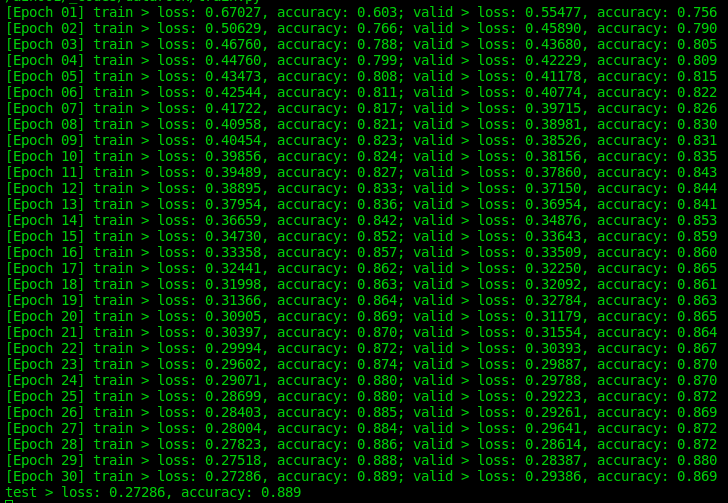

# programming_test

## Environment
This code was developed on ubuntu 22.04 in a conda environment

To recreate the conda environment run:
> conda env create -f env.yml

## Executing the code

To run the code after activating the conda environment:
> python train.py

## Training progress

## Results

